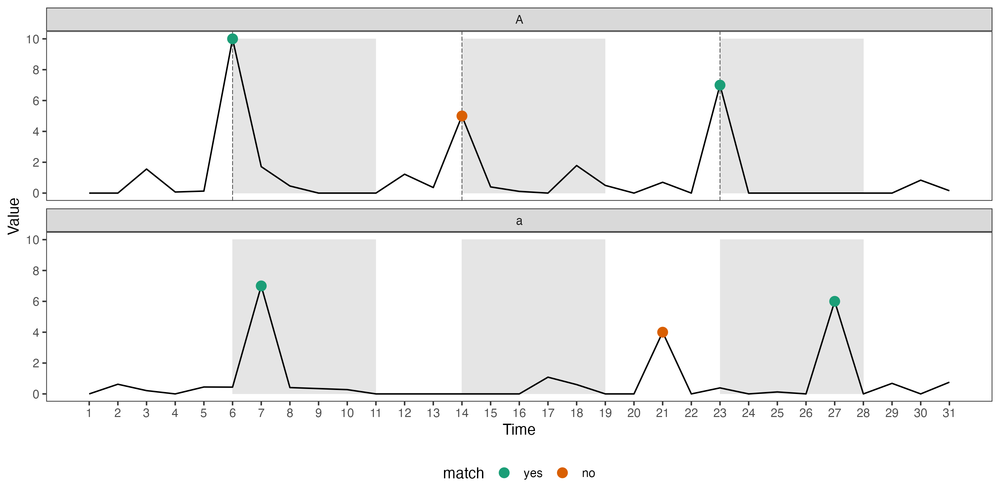

# Advanced features/ considerations

## Hierarchical structure


Imposing a clustering structure can be thought of as building a hierarchical structure where stations are nested within clusters. This can be useful when there's intrinsic nesting structure in the data (i.e. country nested in the continent, county nested in the state) or there's some clustering. When we have access to both level, `switch_key()` is the function to re-structure the data as one cluster per row. Temporal observations from different stations while within the same cluster are bound in the nested column `ts`.

One thing we hope to do with the cluster is to find the coordinates of the centroid. These are variables variant to the station but invariant to the cluster and it would be nice to have a function that structure each cluster as a row. `switch_key()` is the function that does this: it lets you to specify a new key, say `cluster` and nests all spatial variables variant to `cluster` into a column. Spatial variables are all nested inside a new column `.val`. Temporal observations from different stations while within the same cluster are bound in the nested column `ts`.

This structure makes it easy to compute cluster level variable, for example, the convex hull and the centroid coordinate of each cluster. These can be amended into the nested form with function `get_centroid`.

After we have got `cluster_nested`, spatial and temporal data at both levels can be easily obtained. Figure \ref{fig:illu-hier} illustrate the relationship between the long and nested form cubble at both site and cluster level. More description on this. Start with the original `station_nested`, `stretch()` expands the `ts` column with each station (`id`) forming a group and attach variables invariant to `id` as an attribute. `switch_key()` changes the `key` from `id` to `cluster` and nests all the spatial variables that variant to `cluster`. `stretch()` `cluster_nested` will store variables that are invariant to `cluster` as a tibble in the attribute.

this fit into the remaining data pipeline. 

```{r illu-hier, echo = FALSE, fig.align="center", out.width = "100%", fig.cap = "Hierarchical structure"}
knitr::include_graphics(here::here("figures/diagram-keynotes/diagram-keynotes.003.png"))
```

## Data fusion and matching

Temporal matching checks how spatially matched pairs align temporally. We use the following chart to illustrate how the temporal matching works:

For each spatially matched pair, say `A` and `a`, we first find the largest `n` points in each series, colored in brown points here. Here we use the largest three but you can tune this number by `temporal_n_highest`. Then we construct the interval of the largest points from one series and see how many points, from the other series, fall into the intervals. The series used to construct the interval is controlled by `temporal_independent` and the window size by `temporal_window` with a default of 5.

In this illustration, we construct the interval based on series `A` and two of the three peaks from `a` falls into this interval at Time 7 and 27.

There's another mandatory argument that hasn't been introduced above: `temporal_var_to_match`. This argument controls the variable to match and it needs to appear in both the `major` and `minor` set. In the water level matching example, we match the variable `Water_course_level` from `river` to `prcp` from `climate`, hence need to manually rename one of them to match the other, here we rename `Water_course_level` to `prcp` in `river`:


Figure \ref{fig:illu-matching}

```{r illu-matching, out.width="100%", out.height="30%", fig.cap="sdfasdf"}

```

## Interactive graphics

<!-- Interactive graphics can listen to users' actions on the plot to provide additional information that facilitates data exploration. This is a useful technique for spatio-temporal data since users can zoom or pan the map to view the local and global structure of the map; use tooltips or popups to query more information about a graphic element; or highlight points to explore its linked views in other plots. In the R community, many implementations have been developed to connect \proglang{R} to \proglang{javascript} to create interactive graphics. In relation to spatio, temporal, and spatio-temporal data, the general purpose packages \pkg{plotly} [@plotly] and \pkg{leaflet} [@leaflet] realise various interactive actions through their corresponding javascript libraries. \pkg{crosstalk} [@crosstalk] and \pkg{tsibbletalk} [@tsibbletalk] implement brushed linking between htmlwidgets. \pkg{ggiraph} [@ggiraph] enables tooltip, self-linking, and customised actions specified through its own \proglang{javascript}. -->

<!-- While many graphic implementations present worked examples to illustrate the usage of the package, few documents the underlying pipeline that transforms the raw data step-by-step to the final view on the screen. There have been some early work in building the data pipeline for (interactive) graphics [@buja1988elements; @buja1996interactive;  @sutherland2000orca] and more recent discussions include @wickham2009plumbing, @xie2014reactive, and @cheng2016enabling. -->

The cubble structure fits in naturally with the interactive graphic pipeline discussed in the literature [@buja1988elements; @buja1996interactive;  @sutherland2000orca; @xie2014reactive; @cheng2016enabling]. Diagram \ref{fig:illu-interactive} illustrates how linking works with the two forms in a cubble, where a time series plot is created with the long cubble and a map is created with the nested cubble. When a user action is captured from the map, the site will be activated in the nested cubble. Then, the nested cubble will communicate to the long cubble to activate all the observations with the same `id`. The long cubble will then highlight the  activated series in the time series plot. 

The linking is also available from the time series plot to the map. The selection on the time series is through selecting the point on the time series and once a point is selected, it will be activated in the long cubble. All the observations that share the same `id`,  either in the long and nested cubble, are then activated. This includes other points in the same time series in the long cubble and the corresponding observation of site in the nested cubble. These activated observations will then being reflected in the updated plots and Diagram \ref{fig:illu-interactive-2} in the Appendix illustrates this process. 

```{r illu-interactive, echo = FALSE, fig.align="center", out.height="40%", out.width = "100%", fig.cap = "demon interactivity"}
knitr::include_graphics(here::here("figures/diagram-keynotes/diagram-keynotes.004.png"))
```

## Glyph map

Glyph map [@Wickham2012-yr] plots the time series as single glyph on the map. 
<!-- Variation of glyph maps has been developed to visualise uncertainty in **Visumap** [@Lucchesi2021] and deal with irregular local grid [@Beecham2021-vk].  -->
In \proglang{R}, `GGally` implements the glyph map through the `glyphs()` function, which outputs a data frame with calculated position (`gx`, `gy`, `gid`) of each point on the time series given the major and minor xy variable using linear algebra (Equation 1 and 2 in @Wickham2012-yr). The data can then be piped into `ggplot` to create the glyph map: 

```{r eval = FALSE, echo = TRUE}
library(ggplot2)
gly <- glyphs(data, 
              x_major = ..., x_minor = ..., 
              y_major = ..., y_minor = ..., ...)

ggplot(gly, aes(gx, gy, group = gid)) + 
  geom_path() 
```

While this calculation can be seen as part of the `setup_data()` in a `ggproto`. A re-implementation of the glyph map as `GeomGlyph` has been made in `cubble` to create the glyph map with `geom_glyph`:

```{r eval = FALSE, echo = TRUE}
ggplot(data = data) +
  geom_glyph(aes(x_major = ..., x_minor = ..., 
                 y_major = ..., y_minor = ...))
```

Polar glyph map can be specify as a parameter, `polar = TRUE`, in the `geom_glyph()`, along with `width` and `height` in either absolute or relative value. Global and local scale can also be controlled by the parameter `global_rescale`, which default to `TRUE`. Reference box and line can be added with separate `geom_glyph_box()` and `geom_glyph_line()`.
