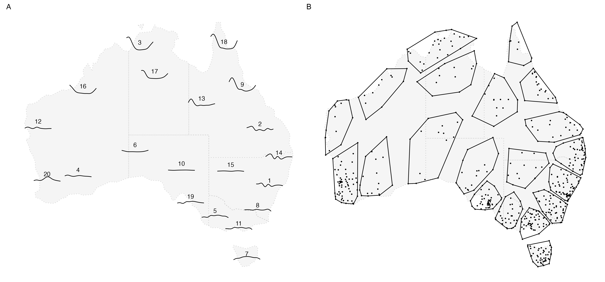

## Australia precipitation pattern in 2020

In the previous example, there has already been some overlapping of the glyphs for a few stations near (151E, 34S) and (152E, 33S) and this will be a problem when mapping more stations in the national level. Aggregation can be helpful to group series into clusters before visualising the cluster with glyph map. 

This example shows how to organise data at both level with \code{switch_key()}. The dataset used is \code{weatherdata::climate_full}, which records daily precipitation and maximum/ minimum temperature for \code{r nrow(weatherdata::climate_full)} stations in Australia from 2016 to 2020. A simple kmean algorithm based on the distance matrix is used here to create 20 clusters. This creates \code{station_nested} as a station level nested cubble with a cluster column indicating the group each station belongs to. More complex algorithms can be used for other problem, as long as there is a mapping from each station to a cluster.

```{r}
load(here::here("data/station_nested.rda"))
```

```{r echo = TRUE, eval = FALSE}
station_nested <- weatherdata::climate_full %>% 
  mutate(cluster = ...)
```

To create a group level cubble, use \code{switch_key()} with the new key variable, \code{cluster}: 

```{r echo = TRUE}
cluster_nested <- station_nested %>% switch_key(cluster) 
```

With the group level cubble, \code{get_centroid()} is useful to compute the centroid of each cluster, which will be used as the major axis for the glyph map later: 

```{r eval = FALSE, echo = TRUE}
cluster_nested <- cluster_nested %>% get_centroid()
```

Long form cubble at both levels can be access through stretching the nested form and operations applicable to long form cubble are still available. With access to both station and cluster level cubbles, various plots can be made to understand the cluster. Figure \ref{fig:basic-agg} shows two example plots that can be made with this data: subplot A makes a glyph map with cluster level cubble and subplot B inspects the station membership of each cluster using the nested station level cubble. 

```{r basic-agg, out.width="100%", fig.cap="Profile of aggregated precipitation from 639 weather stations in Australia. Subplot A shows the glyph map of the weekly averaged precipitation of each cluster. The group number of printed in the middle of y minor axis and can be used as a reference line to read the magnitude of precipitation. Subplot B shows the station membership of each cluster"}

```

