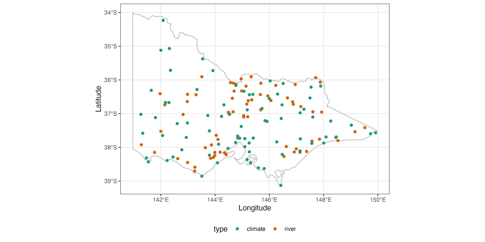
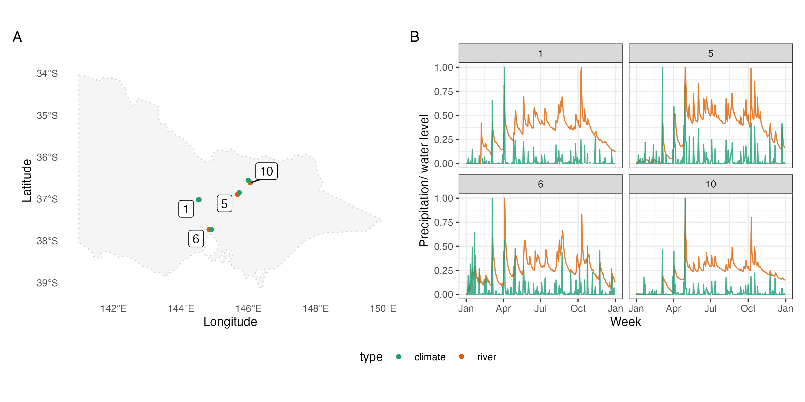

## River level data in Victria water gauges

Water data is collected by the [Bureau of Meteorology](http://www.bom.gov.au/metadata/catalogue/19115/ANZCW0503900528?template=full). This includes ... water gauges, variables collected. In particular, water level will interactive with the climate variable precipitation as rains fall into the river will raise the water level. Figure \ref{fig:matching-map} shows the available weather station and water gauges in Victoria, Melbourne.

```{r echo = TRUE}
climate <- weatherdata::climate_full %>%
  filter(between(stringr::str_sub(id, 7, 8), 76, 90)) %>%
  stretch() %>%
  filter(lubridate::year(date) == 2020) %>%
  tamp() %>%
  mutate(type = "climate")

river <- weatherdata::water %>%
  stretch() %>%
  select(date, Water_course_level) %>%
  rename(prcp = Water_course_level) %>% 
  tamp() %>%
  mutate(type = "river")
```

```{r matching-map, out.width="100%", fig.cap="asdfasd"}

```

From the map, a few water gauges and weather stations are close to each other and we may be able to observe a spontaneous increase in the precipitation and water level from the measures, potential with a little delay in the river gauges. `match_sites()` matches one source of data with another source in both spatial and temporal dimension in a cubble. 

<!-- Now we use `match_sites()` to first pair the weather stations with the river gauges spatially and then apply the temporal matching on `prcp`. We will construct the interval based on peaks in `climate` since we would expect a lag effect for precipitation to flow into the river and cause a raise in river level, hence `temporal_independent = climate`. We select the 30 highest peak from the series to construct the match by setting `temporal_n_highest = 30`. This is a tuning parameter and you can start with 10% of the points of one series (here we have daily data for a year, 10% is roughly 30 points). `temporal_min_match` filters out pairs don't have enough match and to return all the pairs, set `temporal_min_match` to `0`.`` -->

```{r echo = TRUE}
res <- match_sites(river, climate,
                   temporal_var_to_match = prcp,
                   temporal_independent = climate,  
                   temporal_n_highest = 30,
                   temporal_min_match = 15)
```

The output from temporal matching is also a cubble, with additional column `dist` and `group` produced from spatial matching and `n_match` from the number of peak matched temporally. 

```{r}
res
```

Then plots can be made to inspect the matched pairs on the map or to view the co-movement of the two series:

```{r matching, out.width="100%", fig.cap="asdfasd"}

```

With the chosen parameter, four pairs of stations stands out, which all locates in the middle Victoria and the concurrent increase of precipitation and water level can be observed.